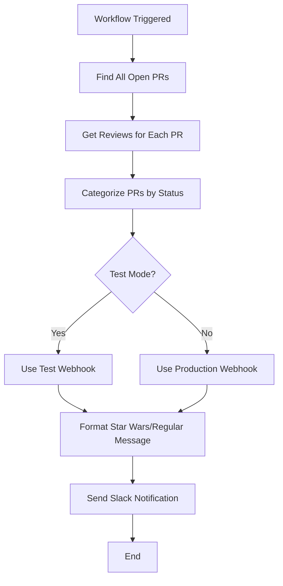
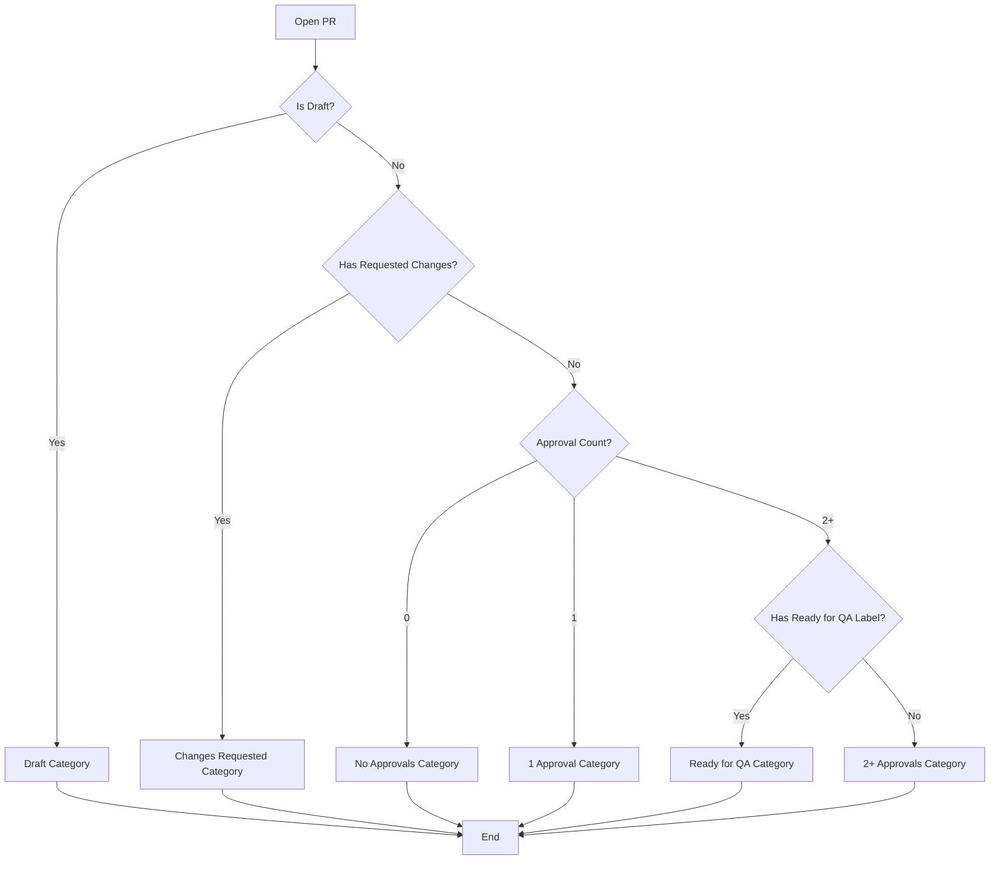
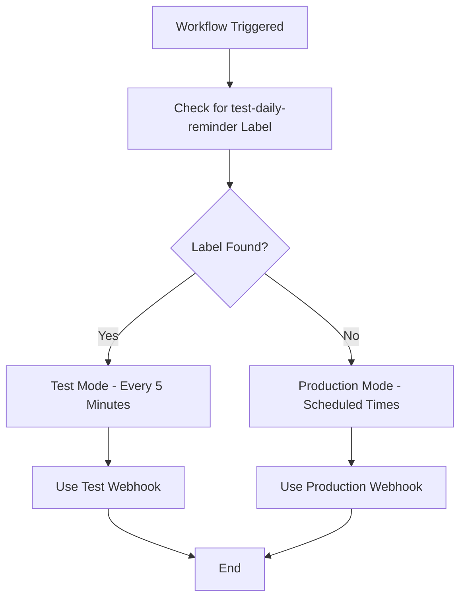

# Daily PR Reminder Workflow Documentation

## Overview

The Daily PR Reminder workflow automatically sends scheduled Slack reminders about open pull requests, categorized by review status. This ensures the team stays informed about PRs that need attention and helps maintain a healthy review process.

## Key Features

- ✅ **Scheduled reminders** at 10 AM and 2 PM PST (6 PM and 10 PM UTC)
- ✅ **PR categorization** by review status (changes requested, approvals, ready for QA, etc.)
- ✅ **Star Wars theme** for evening reminders (2 PM PST)
- ✅ **Label-based testing** with `test-daily-reminder` label
- ✅ **Jira ticket integration** - extracts and links Jira tickets in notifications
- ✅ **Draft PR support** - includes draft PRs in reminders
- ✅ **Test mode support** - runs every 5 minutes when test label exists

## Use Cases

### 1. **Daily PR Status Updates**
- **Trigger**: Scheduled cron jobs (10 AM and 2 PM PST)
- **Action**: Send categorized Slack reminder
- **Purpose**: Keep team informed about PR status

### 2. **Test Mode**
- **Trigger**: `test-daily-reminder` label on any open PR
- **Action**: Send test reminder every 5 minutes
- **Purpose**: Test workflow functionality safely

### 3. **Manual Testing**
- **Trigger**: Manual workflow dispatch
- **Action**: Send immediate reminder
- **Purpose**: Test workflow on demand

## Workflow Triggers

The workflow triggers on these events:
- `schedule` - Cron jobs at 10 AM and 2 PM PST, plus every 5 minutes for test mode
- `push` to `main` or `stage` branches
- `workflow_dispatch` - Manual trigger for testing

## PR Categorization

### 1. **Changes Requested** (Highest Priority)
- **Condition**: PR has requested changes and is not draft
- **Icon**: 🦹 (Sith Corruption) / 🔴 (Regular)
- **Purpose**: Urgent attention needed

### 2. **No Approvals** (Second Priority)
- **Condition**: 0 approvals, no requested changes, not draft, not "Ready for QA"
- **Icon**: ⚡ (Dark Side Threats) / 🔴 (Regular)
- **Purpose**: PRs waiting for first review

### 3. **1 Approval**
- **Condition**: Exactly 1 approval, no requested changes, not draft
- **Icon**: 🦸 (Pending Jedi Training) / 🟠 (Regular)
- **Purpose**: PRs needing second review

### 4. **2+ Approvals - Missing QA Label**
- **Condition**: 2+ approvals, no "Ready for QA" label, no requested changes, not draft
- **Icon**: ⚔️ (Pending Jedi Council) / 🟠 (Regular)
- **Purpose**: PRs ready for QA labeling

### 5. **Ready for QA**
- **Condition**: Has "Ready for QA" label, not draft
- **Icon**: ⭐ (Force Mastery Achieved) / 🟢 (Regular)
- **Purpose**: PRs ready for QA testing

### 6. **Draft PRs** (Lowest Priority)
- **Condition**: PR is marked as draft
- **Icon**: 🤖 (Padawan Missions) / ⚪ (Regular)
- **Purpose**: Work in progress PRs

## Flowcharts

### Main Workflow Flow



### PR Categorization Logic



### Test Mode Detection



## Configuration

### Required Labels

The workflow expects these labels to exist in the repository:
- `test-daily-reminder` - For testing daily reminders (optional)
- `Ready for QA` - For PRs ready for QA testing (optional)

### Slack Integration

The workflow sends formatted Slack notifications with:
- **PR Lists** - Categorized by review status
- **Jira Tickets** - Auto-extracted and linked (if present)
- **Test Mode** - [TEST_MODE] prefix for test notifications
- **Star Wars Theme** - Special formatting for evening reminders

#### Channel Routing
- **Regular reminders** → Production Slack channel (via `SLACK_WEBHOOK_URL_PR`)
- **Test reminders** → Test Slack channel (via `SLACK_WEBHOOK_URL_PR_TEST`)
- **Test mode detection** → Uses `test-daily-reminder` label

### Environment Variables

Required secrets in repository settings:
- `SLACK_WEBHOOK_URL_PR` - Production Slack webhook (main channel)
- `SLACK_WEBHOOK_URL_PR_TEST` - Test Slack webhook (test channel)

### Permissions

The workflow requires these permissions:
- `issues: write` - To manage labels
- `pull-requests: read` - To read PR details and reviews

## Examples

### Example 1: Morning Reminder (10 AM PST)
```
🚨 PRs REMINDER

🔴 CHANGES REQUESTED (2 PRs):
• MWPW-12345: Fix login bug (#123) by @developer1 🔗 MWPW-12345
• MWPW-12346: Update API endpoint (#124) by @developer2 🔗 MWPW-12346

🔴 NO APPROVALS (3 PRs):
• MWPW-12347: Add new feature (#125) by @developer3 🔗 MWPW-12347
• MWPW-12348: Refactor component (#126) by @developer4 🔗 MWPW-12348
• MWPW-12349: Update documentation (#127) by @developer5 🔗 MWPW-12349

🟠 1 APPROVAL (1 PRs):
• MWPW-12350: Fix styling issue (#128) by @developer6 🔗 MWPW-12350

🟢 READY FOR QA (1 PRs):
• MWPW-12351: Performance optimization (#129) by @developer7 🔗 MWPW-12351

⚪ DRAFT PRs (2 PRs):
• MWPW-12352: Work in progress (#130) by @developer8 🔗 MWPW-12352
• MWPW-12353: Experimental feature (#131) by @developer9 🔗 MWPW-12353
```

### Example 2: Evening Reminder (2 PM PST) - Star Wars Theme
```
⚔️ JEDI COUNCIL MEETING

🦹 SITH CORRUPTION DETECTED (2 PRs - Changes Requested):
• MWPW-12345: Fix login bug (#123) by @developer1 🔗 MWPW-12345
• MWPW-12346: Update API endpoint (#124) by @developer2 🔗 MWPW-12346

⚡ DARK SIDE THREATS (3 PRs - 0 approvals):
• MWPW-12347: Add new feature (#125) by @developer3 🔗 MWPW-12347
• MWPW-12348: Refactor component (#126) by @developer4 🔗 MWPW-12348
• MWPW-12349: Update documentation (#127) by @developer5 🔗 MWPW-12349

🦸 PENDING JEDI TRAINING (1 PRs - 1 approval):
• MWPW-12350: Fix styling issue (#128) by @developer6 🔗 MWPW-12350

⭐ FORCE MASTERY ACHIEVED (1 PRs - Ready for QA):
• MWPW-12351: Performance optimization (#129) by @developer7 🔗 MWPW-12351

🤖 PADAWAN MISSIONS (2 PRs - Draft):
• MWPW-12352: Work in progress (#130) by @developer8 🔗 MWPW-12352
• MWPW-12353: Experimental feature (#131) by @developer9 🔗 MWPW-12353
```

### Example 3: Test Mode
```
🚨 PRs REMINDER [TEST_MODE]

🔴 CHANGES REQUESTED (1 PRs):
• MWPW-12345: Fix login bug (#123) by @developer1 🔗 MWPW-12345

🔴 NO APPROVALS (2 PRs):
• MWPW-12347: Add new feature (#125) by @developer3 🔗 MWPW-12347
• MWPW-12348: Refactor component (#126) by @developer4 🔗 MWPW-12348

⚪ DRAFT PRs (1 PRs):
• MWPW-12352: Work in progress (#130) by @developer8 🔗 MWPW-12352
```

## Troubleshooting

### Common Issues

1. **Cron job not running**
   - **Cause**: GitHub Actions cron jobs only run on the default branch (main)
   - **Solution**: Merge changes to main branch or use manual trigger for testing

2. **Test mode not working**
   - **Cause**: Missing test webhook URL or incorrect label
   - **Solution**: Check `SLACK_WEBHOOK_URL_PR_TEST` secret and ensure label is `test-daily-reminder`

3. **No PRs found**
   - **Cause**: No open PRs or API rate limiting
   - **Solution**: Check GitHub API limits and ensure there are open PRs

4. **Wrong categorization**
   - **Cause**: Incorrect review status detection
   - **Solution**: Check PR review states and approval logic

### Debug Information

The workflow logs detailed information:
- Number of open PRs found
- PR categorization results
- Test mode status
- Webhook URL being used
- Notification status

## File Structure

```
.github/workflows/
└── pr-reminder-daily.yml    # Daily PR reminder workflow

DAILY-PR-REMINDER-DOCUMENTATION.md    # This documentation
```

## Testing Guide

### Step-by-Step Testing

1. **Test Label-Based Trigger**
   - Add `test-daily-reminder` label to any open PR
   - Wait up to 5 minutes for workflow to trigger
   - Check Actions tab for workflow run
   - Verify notification sent to test channel

2. **Test Manual Trigger**
   - Go to Actions → "Daily PR Reminder"
   - Click "Run workflow"
   - Verify notification sent to production channel

3. **Test Production Trigger**
   - Merge changes to main branch
   - Wait for scheduled times (10 AM or 2 PM PST)
   - Verify notification sent to production channel

### Verification Checklist

- [ ] Workflow triggers on schedule (main branch only)
- [ ] Workflow triggers on manual dispatch
- [ ] Workflow triggers on label addition (test mode)
- [ ] Test mode uses correct webhook
- [ ] Production mode uses correct webhook
- [ ] PRs are categorized correctly
- [ ] Jira tickets are extracted and linked
- [ ] Star Wars theme works for evening reminders
- [ ] Test mode shows [TEST_MODE] prefix

---

## Maintenance

### Adding New PR Categories
1. Update categorization logic in workflow
2. Add new category to message formatting
3. Test with various PR states
4. Update documentation

### Modifying Schedule
1. Update cron expressions in workflow
2. Test with manual triggers
3. Update documentation

### Testing Changes
1. Use `test-daily-reminder` label for safe testing
2. Test with manual trigger
3. Verify both webhook URLs work correctly
4. Test PR categorization logic
