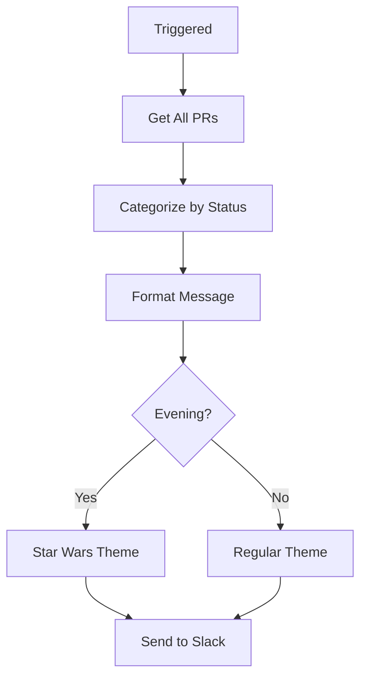

# ⏰ Daily PR Reminder Workflow with Star Wars Theme

## Overview
This PR implements a comprehensive daily PR reminder system that sends scheduled Slack notifications about all open pull requests, categorized by review status, with Star Wars themed evening reminders for enhanced team engagement.

## ✨ Key Features

### ⏰ **Daily PR Reminder** (`pr-reminder-daily.yml`)
- Runs at 10 AM and 2 PM PST daily
- Star Wars themed evening reminders
- Categorizes PRs by review status with priority-based ordering
- Test mode every 5 minutes on feature branch
- Includes all PRs including drafts

### 🧪 **Enhanced Testing** (`test-workflows.yml`)
- Actionlint for GitHub Actions validation
- YAML schema validation
- Custom JavaScript business logic tests
- Dry-run testing with `act`

## 📊 Workflow Flow

### Daily PR Reminder

### PR Categorization
- **Changes Requested** (Highest Priority) - "SITH CORRUPTION DETECTED"
- **No Approvals** (Second Priority) - "DARK SIDE THREATS"
- **One Approval** (Third Priority) - "PENDING JEDI TRAINING"
- **Two+ Approvals - Missing QA Label** (Fourth Priority) - "PENDING JEDI COUNCIL"
- **Ready for QA** (Fifth Priority) - "FORCE MASTERY ACHIEVED"
- **Draft PRs** (Lowest Priority) - "PADAWAN MISSIONS"

## 🧪 Testing

### Manual Testing
1. **Daily Reminder**: Use GitHub Actions UI → "Run workflow" button
2. **Test Mode**: Push to feature branch, verify 5-minute intervals
3. **Star Wars Theme**: Test evening reminders for epic theming

### Automated Testing
- Workflow linting with actionlint
- YAML validation
- Custom JavaScript tests
- Security scanning

## 📚 Documentation
- **[DAILY-PR-REMINDER-DOCUMENTATION.md](./DAILY-PR-REMINDER-DOCUMENTATION.md)**: Complete workflow docs with testing guides

## 📁 Files Changed
- `.github/workflows/pr-reminder-daily.yml` - Daily reminders with Star Wars theme
- `.github/workflows/test-workflows.yml` - Enhanced testing
- `DAILY-PR-REMINDER-DOCUMENTATION.md` - Comprehensive documentation
- Various test files and utilities

## 🎯 Impact
- **Enhanced Team Communication**: Star Wars themed reminders increase engagement
- **Better Workflow Visibility**: Comprehensive PR status overview
- **Reduced Manual Overhead**: Automated daily reminders
- **Clear Prioritization**: PRs categorized by urgency

## 🚀 Ready for Review
All workflows tested in feature branch. Use manual triggers for immediate validation.
