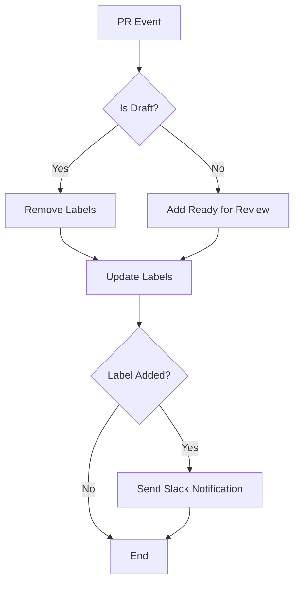

# 🚀 Enhanced QA Label Management Workflow

## Overview
This PR implements a streamlined GitHub Actions workflow for automated PR label management with Slack notifications and comprehensive testing infrastructure.

## ✨ Key Features

### 🔄 **QA Label Management** (`qa-label-management.yml`)
- Auto-adds "Ready for Review" labels to non-draft PRs
- Removes labels from draft PRs
- Sends Slack notifications with Jira ticket integration
- Test mode with `test-ready-for-review-slack` label

### 🧪 **Enhanced Testing** (`test-workflows.yml`)
- Actionlint for GitHub Actions validation
- YAML schema validation
- Custom JavaScript business logic tests
- Dry-run testing with `act`

## 📊 Workflow Flow

### QA Label Management

## 🧪 Testing

### Manual Testing
1. **QA Workflow**: Add `test-ready-for-review-slack` label to PR
2. **Verify Results**: Check "Ready for Review" label added + Slack notification sent

### Automated Testing
- Workflow linting with actionlint
- YAML validation
- Custom JavaScript tests
- Security scanning

## 📚 Documentation
- **[QA-LABEL-MANAGEMENT-DOCUMENTATION.md](./QA-LABEL-MANAGEMENT-DOCUMENTATION.md)**: Complete workflow docs with testing guides

## 📁 Files Changed
- `.github/workflows/qa-label-management.yml` - Simplified PR labeling
- `.github/workflows/test-workflows.yml` - Enhanced testing
- `QA-LABEL-MANAGEMENT-DOCUMENTATION.md` - Comprehensive documentation
- Various test files and utilities

## 🎯 Impact
- **Better Workflow Visibility**: Clear PR status and automated notifications
- **Reduced Manual Overhead**: Automated label management
- **Better Code Quality**: Robust testing infrastructure

## 🚀 Ready for Review
All workflows tested in feature branch. Use manual triggers for immediate validation.
