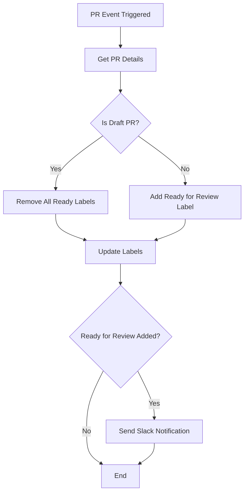
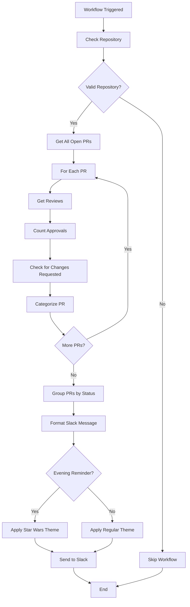
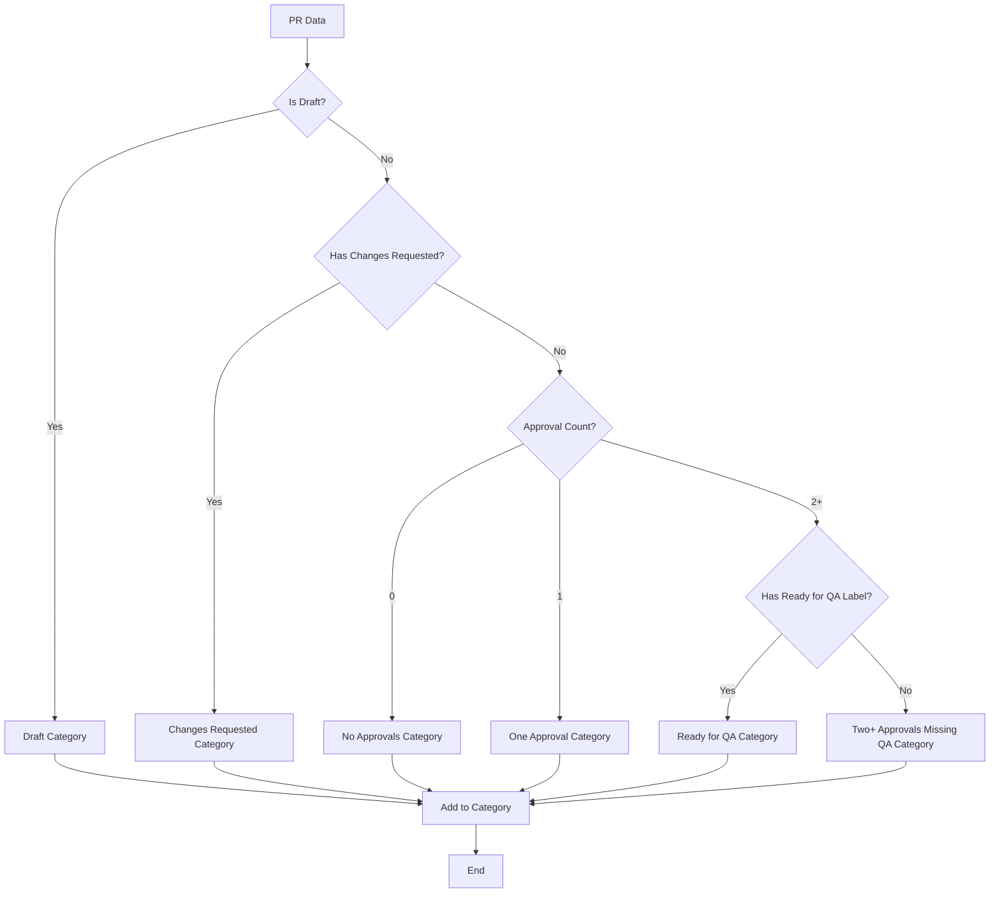

# 🚀 PR Summary: Enhanced GitHub Actions Workflows & Documentation

## 📋 Overview
This PR introduces comprehensive improvements to our GitHub Actions workflows, focusing on PR label management, automated reminders, and robust testing infrastructure. The changes streamline our development workflow while maintaining high code quality standards.

## ✨ Key Features

### 🔄 **QA Label Management Workflow** (`qa-label-management.yml`)
- **Simplified Logic**: Removed complex approval-based logic, now focuses purely on "Ready for Review" labels
- **Smart Draft Handling**: Automatically removes labels from draft PRs
- **Slack Integration**: Sends formatted notifications when PRs become ready for review
- **Test Mode**: Supports `test-ready-for-review-slack` label for safe testing
- **Jira Integration**: Auto-extracts and links Jira tickets in notifications

### ⏰ **Daily PR Reminder Workflow** (`pr-reminder-daily.yml`)
- **Scheduled Reminders**: Runs at 10 AM and 2 PM PST daily
- **Star Wars Theme**: Evening reminders use epic Star Wars terminology for engagement
- **Comprehensive Categorization**: Groups PRs by review status with priority-based ordering
- **Test Mode Support**: 5-minute intervals for feature branch testing
- **Draft PR Inclusion**: Shows all PRs including work-in-progress drafts

### 🧪 **Enhanced Testing Infrastructure** (`test-workflows.yml`)
- **Multi-layer Testing**: Structure, syntax, business logic, and security validation
- **Actionlint Integration**: Static analysis for GitHub Actions best practices
- **YAML Validation**: Schema validation and syntax checking
- **Dry-run Testing**: Safe testing with `act` tool
- **Custom JavaScript Tests**: Business logic validation for complex workflows

## 📊 Workflow Flowcharts

### QA Label Management Flow


### Daily PR Reminder Flow


### PR Categorization Logic


## 🧪 Testing Strategy

### Manual Testing (Recommended)

#### 1. QA Label Management Testing
1. **Navigate to GitHub Actions**
   - Go to repository → Actions tab
   - Find "QA Label Management" workflow

2. **Test with Labels**
   - Create test PR or use existing one
   - Add `test-ready-for-review-slack` label
   - Verify "Ready for Review" label is added
   - Check Slack notification sent to test channel

3. **Test Draft PRs**
   - Mark PR as draft
   - Verify "Ready for Review" label is removed
   - Verify no Slack notification is sent

#### 2. Daily PR Reminder Testing
1. **Manual Trigger**
   - Go to Actions tab → "Daily PR Reminder" workflow
   - Click "Run workflow" button
   - Select `feature/pr-label-management` branch for test webhook
   - Click "Run workflow"

2. **Verify Results**
   - Check test Slack channel for notification
   - Verify PRs are properly categorized
   - Check for Star Wars theme in evening reminders

### Automated Testing
- **Workflow Linting**: Actionlint validates syntax and best practices
- **YAML Validation**: Schema validation and syntax checking
- **Business Logic Tests**: Custom JavaScript tests for complex workflows
- **Security Scanning**: Automated security analysis

## 📚 Documentation

### Comprehensive Documentation Added
- **[QA-LABEL-MANAGEMENT-DOCUMENTATION.md](./QA-LABEL-MANAGEMENT-DOCUMENTATION.md)**: Complete workflow documentation with:
  - Step-by-step testing guides
  - Troubleshooting sections
  - Configuration details
  - Environment variable setup
  - Flowcharts and examples

### Key Documentation Sections
- **Workflow Triggers**: Complete list of GitHub events
- **Label Logic**: Clear decision trees for label management
- **Slack Integration**: Channel routing and message formatting
- **Testing Guide**: Manual and automated testing approaches
- **Troubleshooting**: Common issues and solutions

## 🔧 Technical Improvements

### Code Quality
- **ESLint Compliance**: All JavaScript follows project linting rules
- **Error Handling**: Robust error handling with graceful degradation
- **Performance**: Optimized API calls and efficient data processing
- **Security**: Secure webhook handling and input validation

### Infrastructure
- **GitHub Actions**: Modern v4 actions with proper permissions
- **Environment Variables**: Secure secret management
- **Repository Conditions**: Proper branch and repository validation
- **Logging**: Comprehensive logging for debugging and monitoring

## 📁 Files Changed

### Workflow Files
- `.github/workflows/qa-label-management.yml` - Simplified PR label management
- `.github/workflows/pr-reminder-daily.yml` - Daily PR reminders with Star Wars theme
- `.github/workflows/test-workflows.yml` - Enhanced testing infrastructure
- `.github/workflows/codeql.yml` - Updated security scanning

### Configuration Files
- `.gitignore` - Added actionlint to ignored files
- `.yamllint` - YAML linting configuration

### Documentation
- `QA-LABEL-MANAGEMENT-DOCUMENTATION.md` - Comprehensive workflow documentation

### Test Files
- `scripts/simple-workflow-test.js` - Simple workflow testing utility
- `scripts/tests/qa-label-management.test.js` - QA workflow business logic tests

### Template X Promo Block
- `express/code/blocks/template-x-promo/` - Template X Promo block implementation
- `nala/blocks/template-x-promo/` - Nala test files for Template X Promo

## 🎯 Impact

### Workflow Improvements
- **Improved Workflow Visibility**: Clear PR status indicators and automated notifications
- **Enhanced Team Communication**: Star Wars themed reminders increase engagement
- **Reduced Manual Overhead**: Automated label management and comprehensive reminders
- **Better Code Quality**: Robust testing infrastructure catches issues early

### Documentation Benefits
- **Comprehensive Guides**: Clear documentation for maintenance and troubleshooting
- **Testing Instructions**: Step-by-step testing procedures for all workflows
- **Troubleshooting**: Common issues and solutions documented
- **Configuration**: Clear setup instructions for environment variables

## 🚀 Ready for Review

This PR is ready for review and testing. All workflows have been tested in the feature branch environment and documentation is comprehensive for future maintenance.

### Next Steps
1. **Review the code changes** in the workflow files
2. **Test the workflows** using the manual trigger approach
3. **Verify Slack notifications** are working correctly
4. **Check documentation** for completeness and accuracy

### Testing Commands
```bash
# Test workflow syntax
actionlint .github/workflows/*.yml

# Test YAML validation
yamllint .github/workflows/

# Run custom tests
node scripts/tests/qa-label-management.test.js
```

**Test the workflows**: Use the manual trigger approach documented in the testing guide for immediate validation.
