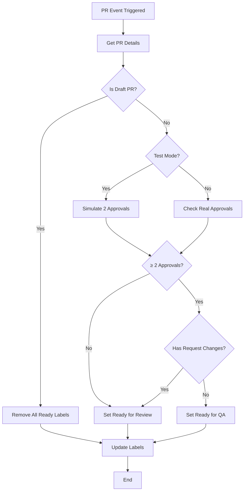
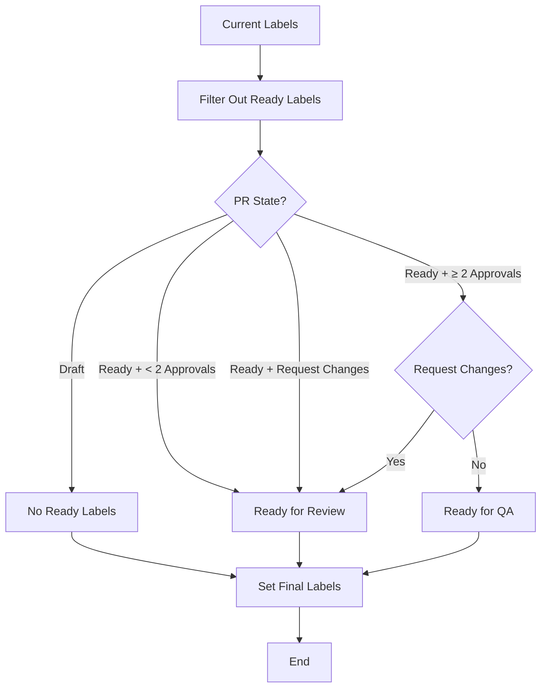
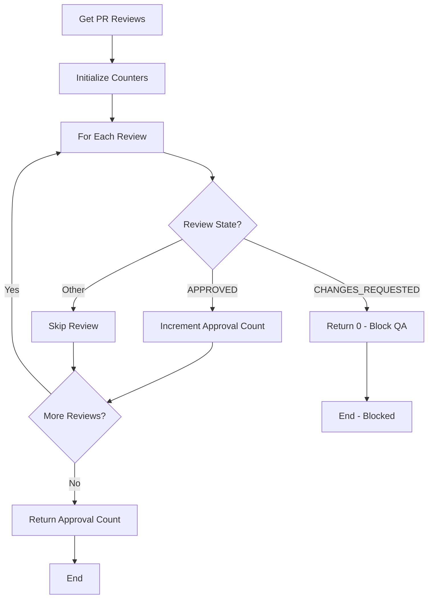

# QA Label Management Workflow Documentation

## Overview

The QA Label Management workflow automatically manages "Ready for Review" and "Ready for QA" labels on pull requests based on their approval status and draft state. This ensures proper workflow visibility and helps teams understand when PRs are ready for the next stage.

## Use Cases

### 1. **Draft PR Management**
- **Trigger**: PR is marked as draft
- **Action**: Remove all Ready labels
- **Purpose**: Draft PRs shouldn't have Ready labels

### 2. **Approval-Based Labeling**
- **Trigger**: PR receives reviews (approvals or changes requested)
- **Action**: Set appropriate Ready label based on approval count
- **Purpose**: Automatically indicate PR readiness for next stage

### 3. **Test Mode**
- **Trigger**: `test-qa-workflow` label is added
- **Action**: Simulate 2 approvals for testing
- **Purpose**: Allow testing without requiring real approvals

## Workflow Triggers

The workflow triggers on these pull request events:
- `opened` - New PR created
- `edited` - PR details modified
- `ready_for_review` - PR moved from draft to ready
- `converted_to_draft` - PR moved from ready to draft
- `labeled` - Labels added to PR
- `unlabeled` - Labels removed from PR
- `submitted` - Reviews submitted
- `synchronize` - PR updated with new commits
- `reopened` - PR reopened after being closed

## Label Logic

### Ready for Review (Default)
- **Condition**: Non-draft PR with < 2 approvals OR has "request changes" review
- **Purpose**: Indicates PR needs review

### Ready for QA
- **Condition**: Non-draft PR with ≥ 2 approvals AND no "request changes" review
- **Purpose**: Indicates PR is ready for QA testing

### No Ready Labels
- **Condition**: Draft PR
- **Purpose**: Draft PRs shouldn't show readiness status

## Flowcharts

### Main Workflow Flow



### Label Decision Logic



### Approval Checking Process



## Configuration

### Required Labels

The workflow expects these labels to exist in the repository:
- `Ready for Review` - For PRs needing review
- `Ready for QA` - For PRs ready for QA testing
- `test-qa-workflow` - For testing mode (optional)

### Permissions

The workflow requires these permissions:
- `issues: write` - To manage labels
- `pull-requests: read` - To read PR details and reviews

## Examples

### Example 1: New PR
```
1. PR created → "Ready for Review" added
2. 2 approvals added → "Ready for QA" added, "Ready for Review" removed
3. Request changes added → "Ready for Review" added, "Ready for QA" removed
```

### Example 2: Draft PR
```
1. PR created as draft → No Ready labels
2. PR marked as ready → "Ready for Review" added
3. PR marked as draft again → No Ready labels
```

### Example 3: Test Mode
```
1. Add "test-qa-workflow" label → "Ready for QA" added
2. Remove "test-qa-workflow" label → "Ready for Review" added
```

## Troubleshooting

### Common Issues

1. **Labels not updating immediately**
   - **Cause**: GitHub UI cache delay
   - **Solution**: Hard refresh browser (Ctrl+F5 / Cmd+Shift+R)

2. **Workflow not triggering**
   - **Cause**: Missing trigger events
   - **Solution**: Check workflow triggers in `.github/workflows/qa-label-management.yml`

3. **Wrong labels applied**
   - **Cause**: Approval count logic error
   - **Solution**: Check approval counting logic in workflow

### Debug Information

The workflow logs detailed information:
- Current labels on PR
- PR state (draft/ready)
- Test mode status
- Approval count
- Label changes made

## File Structure

```
.github/workflows/
└── qa-label-management.yml    # Main workflow file

dev/
└── QA-LABEL-MANAGEMENT-DOCUMENTATION.md    # This documentation
```

## Maintenance

### Adding New Triggers
1. Add trigger to `on.pull_request.types` array
2. Test with appropriate PR events
3. Update documentation

### Modifying Label Logic
1. Update label decision logic in workflow
2. Test with various PR states
3. Update flowcharts and documentation

### Testing Changes
1. Use `test-qa-workflow` label for safe testing
2. Test with real PR approvals
3. Verify label transitions work correctly
