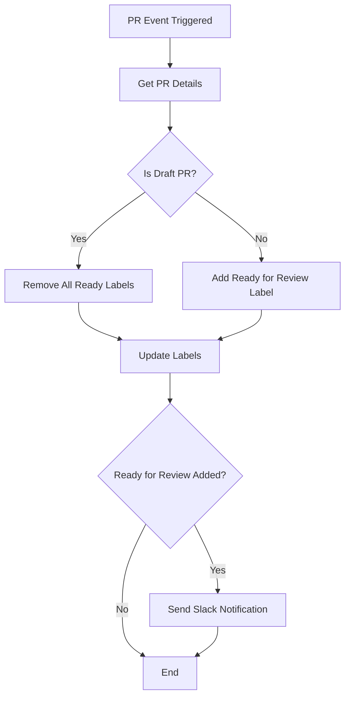
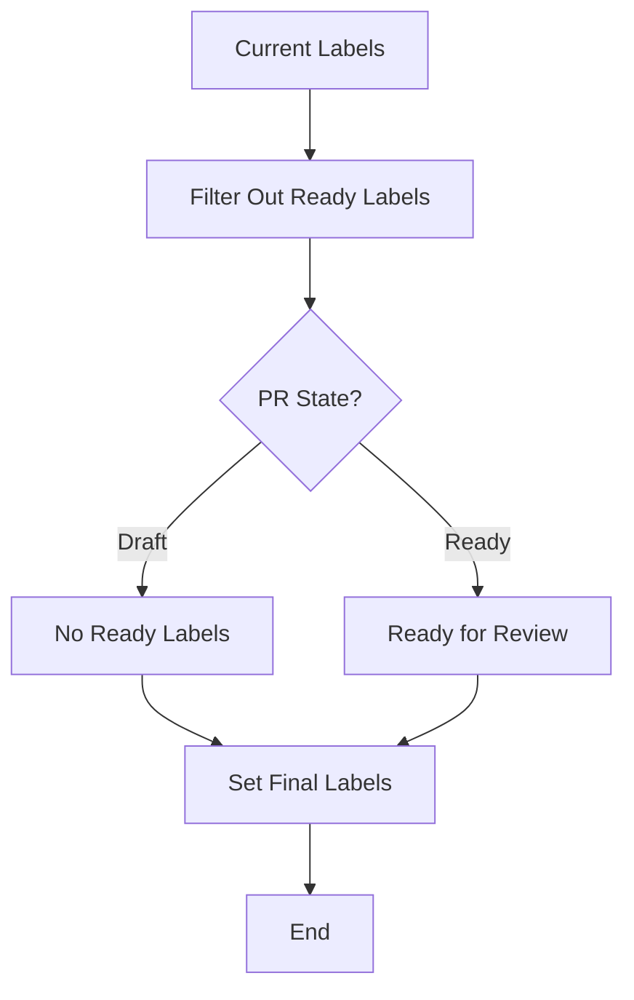
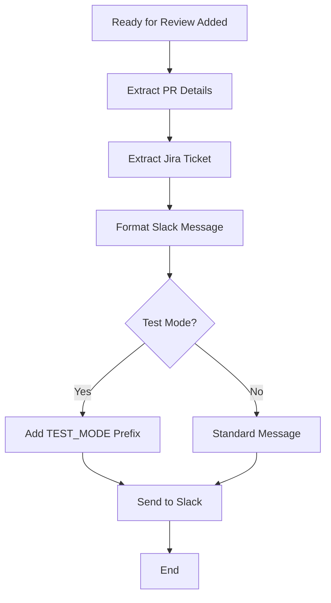
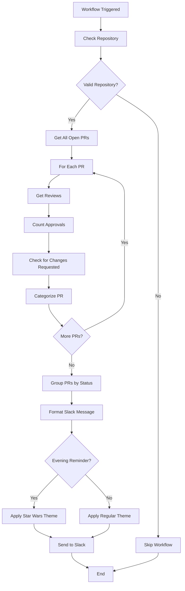
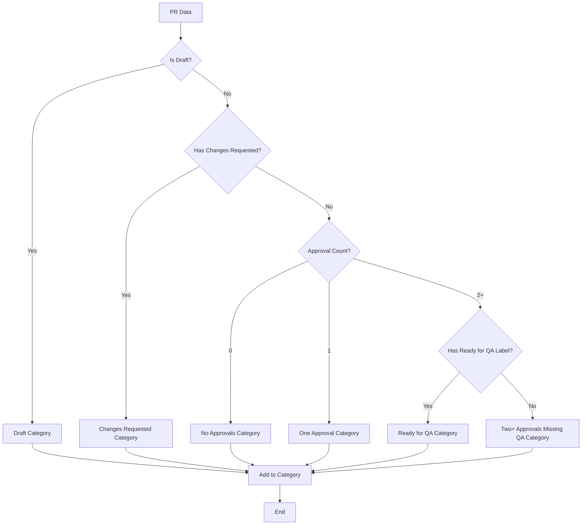
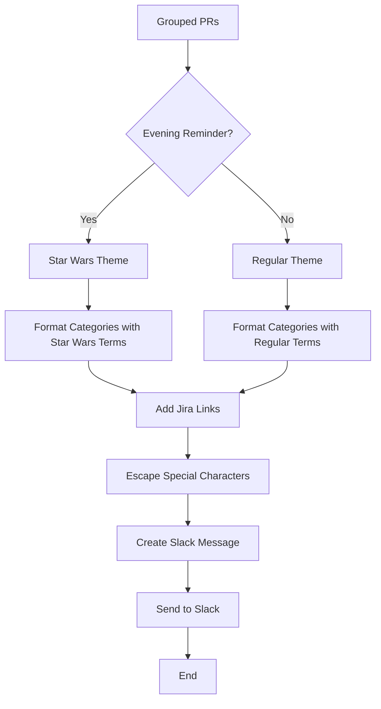

# QA Label Management Workflow Documentation

## Overview

The QA Label Management workflow automatically manages "Ready for Review" labels on pull requests and sends Slack notifications when PRs are ready for review. This ensures proper workflow visibility and keeps the team informed about PR status changes.

## Key Features

- ✅ **Automatic "Ready for Review" labeling** for non-draft PRs
- ✅ **Slack notifications** when PRs become ready for review
- ✅ **Draft PR management** - removes labels from draft PRs
- ✅ **Test mode support** with `test-ready-for-review-slack` label
- ✅ **Jira ticket integration** - extracts and links Jira tickets in notifications

## Use Cases

### 1. **Ready for Review Labeling**
- **Trigger**: PR is created or moved from draft to ready
- **Action**: Add "Ready for Review" label
- **Purpose**: Indicate PR needs review

### 2. **Draft PR Management**
- **Trigger**: PR is marked as draft
- **Action**: Remove all Ready labels
- **Purpose**: Draft PRs shouldn't have Ready labels

### 3. **Slack Notifications**
- **Trigger**: "Ready for Review" label is added to non-draft PR
- **Action**: Send formatted Slack notification
- **Purpose**: Notify team when PRs are ready for review

### 4. **Test Mode**
- **Trigger**: `test-ready-for-review-slack` label is added
- **Action**: Send test Slack notification to test channel
- **Purpose**: Test Slack integration without affecting real PRs or production channel

## Workflow Triggers

The workflow triggers on these pull request events:
- `opened` - New PR created
- `edited` - PR details modified
- `ready_for_review` - PR moved from draft to ready
- `converted_to_draft` - PR moved from ready to draft
- `labeled` - Labels added to PR
- `unlabeled` - Labels removed from PR
- `submitted` - Reviews submitted
- `synchronize` - PR updated with new commits
- `reopened` - PR reopened after being closed

## Label Logic

### Ready for Review (Default)
- **Condition**: Non-draft PR
- **Purpose**: Indicates PR needs review
- **Slack Notification**: ✅ Sent when label is added

### No Ready Labels
- **Condition**: Draft PR
- **Purpose**: Draft PRs shouldn't show readiness status
- **Slack Notification**: ❌ Not sent

### Test Mode
- **Condition**: `test-ready-for-review-slack` label present
- **Purpose**: Test Slack notification functionality
- **Slack Notification**: ✅ Sent with [TEST_MODE] prefix

## Flowcharts

### Main Workflow Flow



### Label Decision Logic



### Slack Notification Process



## Configuration

### Required Labels

The workflow expects these labels to exist in the repository:
- `Ready for Review` - For PRs needing review
- `test-ready-for-review-slack` - For testing Slack notifications (optional)

### Slack Integration

The workflow sends formatted Slack notifications with:
- **PR Title** - Extracted and formatted
- **Author** - GitHub username
- **Branch Info** - Source → target branch
- **Jira Ticket** - Auto-extracted and linked (if present)
- **Test Mode** - [TEST_MODE] prefix for test notifications

#### Channel Routing
- **Regular notifications** → Production Slack channel (via `SLACK_WEBHOOK_URL_PR`)
- **Test notifications** → Test Slack channel (via `SLACK_WEBHOOK_URL_PR_TEST`)
- **Test mode detection** → Uses `test-ready-for-review-slack` label

### Environment Variables

Required secrets in repository settings:
- `SLACK_WEBHOOK_URL_PR` - Production Slack webhook (main channel)
- `SLACK_WEBHOOK_URL_PR_TEST` - Test Slack webhook (test channel)

### Permissions

The workflow requires these permissions:
- `issues: write` - To manage labels
- `pull-requests: read` - To read PR details and reviews

## Examples

### Example 1: New PR
```
1. PR created → "Ready for Review" added + Slack notification sent
2. PR marked as draft → "Ready for Review" removed
3. PR marked as ready again → "Ready for Review" added + Slack notification sent
```

### Example 2: Draft PR
```
1. PR created as draft → No Ready labels, no Slack notification
2. PR marked as ready → "Ready for Review" added + Slack notification sent
3. PR marked as draft again → "Ready for Review" removed
```

### Example 3: Test Mode
```
1. Add "test-ready-for-review-slack" label → Slack notification sent to test channel with [TEST_MODE] prefix
2. Remove "test-ready-for-review-slack" label → No additional action
```

## Troubleshooting

### Common Issues

1. **Labels not updating immediately**
   - **Cause**: GitHub UI cache delay
   - **Solution**: Hard refresh browser (Ctrl+F5 / Cmd+Shift+R)

2. **Workflow not triggering**
   - **Cause**: Missing trigger events
   - **Solution**: Check workflow triggers in `.github/workflows/qa-label-management.yml`

3. **Slack notifications not sending**
   - **Cause**: Missing or invalid SLACK_WEBHOOK_URL
   - **Solution**: Check environment variables in workflow

4. **Wrong labels applied**
   - **Cause**: Draft state detection error
   - **Solution**: Check PR draft state logic in workflow

### Debug Information

The workflow logs detailed information:
- Current labels on PR
- PR state (draft/ready)
- Test mode status
- Slack notification status
- Label changes made

## File Structure

```
.github/workflows/
├── qa-label-management.yml    # PR label management workflow
└── pr-reminder-daily.yml      # Daily PR reminder workflow

QA-LABEL-MANAGEMENT-DOCUMENTATION.md    # This documentation (root directory)
```

---

# Daily PR Reminder Workflow Documentation

## Overview

The Daily PR Reminder workflow sends comprehensive Slack notifications about all open pull requests, categorized by their review status. It runs twice daily (10 AM and 2 PM PST) to keep the team informed about PR status and ensure nothing gets overlooked.

## Key Features

- ✅ **Scheduled reminders** - Runs at 10 AM and 2 PM PST daily
- ✅ **Comprehensive PR categorization** - Groups PRs by review status
- ✅ **Star Wars theme** - Evening reminders use epic Star Wars terminology
- ✅ **Jira ticket integration** - Auto-extracts and links Jira tickets
- ✅ **Test mode support** - 5-minute intervals for feature branch testing
- ✅ **Draft PR inclusion** - Shows all PRs including drafts

## Workflow Triggers

### Scheduled Runs
- **10 AM PST** (6 PM UTC) - Morning reminder
- **2 PM PST** (10 PM UTC) - Evening reminder with Star Wars theme
- **Every 5 minutes** - Test mode (feature branch only)

### Manual Triggers
- **Push to feature branch** - For testing
- **Workflow dispatch** - Manual trigger for testing

## PR Categorization

### 1. **Changes Requested** (Highest Priority)
- **Condition**: PR has "CHANGES_REQUESTED" review
- **Theme**: "SITH CORRUPTION DETECTED" / "CHANGES REQUESTED"
- **Purpose**: Urgent action needed

### 2. **No Approvals** (Second Priority)
- **Condition**: PR has 0 approvals and no changes requested
- **Theme**: "DARK SIDE THREATS" / "NO APPROVALS"
- **Purpose**: Needs initial review

### 3. **One Approval** (Third Priority)
- **Condition**: PR has exactly 1 approval
- **Theme**: "PENDING JEDI TRAINING" / "1 APPROVAL"
- **Purpose**: Needs second review

### 4. **Two+ Approvals - Missing QA Label** (Fourth Priority)
- **Condition**: PR has 2+ approvals but no "Ready for QA" label
- **Theme**: "PENDING JEDI COUNCIL" / "2+ APPROVALS - MISSING QA LABEL"
- **Purpose**: Needs QA label application

### 5. **Ready for QA** (Fifth Priority)
- **Condition**: PR has "Ready for QA" label
- **Theme**: "FORCE MASTERY ACHIEVED" / "READY FOR QA"
- **Purpose**: Ready for QA testing

### 6. **Draft PRs** (Lowest Priority)
- **Condition**: PR is marked as draft
- **Theme**: "PADAWAN MISSIONS" / "DRAFT PRs"
- **Purpose**: Work in progress

## Flowcharts

### Main Workflow Flow



### PR Categorization Logic



### Message Formatting Process



## Configuration

### Schedule Configuration

```yaml
schedule:
  # Production: Run at 10 AM and 2 PM PST
  - cron: '0 18 * * *'  # 6 PM UTC (10 AM PST)
  - cron: '0 22 * * *'  # 10 PM UTC (2 PM PST)
  # Testing: every 5 minutes (feature branch only)
  - cron: '*/5 * * * *'  # Every 5 minutes (test mode only)
```

### Environment Variables

Required secrets in repository settings:
- `SLACK_WEBHOOK_URL_PR` - Production Slack webhook
- `SLACK_WEBHOOK_URL_PR_TEST` - Test Slack webhook (optional)

### Permissions

The workflow requires these permissions:
- `pull-requests: read` - To read PR details and reviews
- `contents: read` - To checkout repository

## Examples

### Morning Reminder (Regular Theme)
```
🚨 PRs REMINDER

🔴 CHANGES REQUESTED (2 PRs):
• MWPW-12345: Fix button alignment (#123) by @developer1 🔗 MWPW-12345
• MWPW-12346: Update documentation (#124) by @developer2 🔗 MWPW-12346

🔴 NO APPROVALS (3 PRs):
• MWPW-12347: Add new feature (#125) by @developer3 🔗 MWPW-12347
• MWPW-12348: Fix bug (#126) by @developer4 🔗 MWPW-12348
• MWPW-12349: Refactor code (#127) by @developer5 🔗 MWPW-12349
```

### Evening Reminder (Star Wars Theme)
```
⚔️ JEDI COUNCIL MEETING

🦹 SITH CORRUPTION DETECTED (2 PRs - Changes Requested):
• MWPW-12345: Fix button alignment (#123) by @developer1 🔗 MWPW-12345
• MWPW-12346: Update documentation (#124) by @developer2 🔗 MWPW-12346

⚡ DARK SIDE THREATS (3 PRs - 0 approvals):
• MWPW-12347: Add new feature (#125) by @developer3 🔗 MWPW-12347
• MWPW-12348: Fix bug (#126) by @developer4 🔗 MWPW-12348
• MWPW-12349: Refactor code (#127) by @developer5 🔗 MWPW-12349
```

## Troubleshooting

### Common Issues

1. **Workflow not running**
   - **Cause**: Invalid cron schedule or repository conditions
   - **Solution**: Check schedule syntax and repository owner

2. **Slack notifications not sending**
   - **Cause**: Missing or invalid SLACK_WEBHOOK_URL
   - **Solution**: Check environment variables in workflow

3. **PRs not appearing in reminders**
   - **Cause**: PR filtering logic or API limits
   - **Solution**: Check PR list API calls and pagination

4. **JSON serialization errors**
   - **Cause**: Special characters in PR titles/descriptions
   - **Solution**: Check escapeJson function and data cleaning

### Debug Information

The workflow logs detailed information:
- Total open PRs found
- PRs by category count
- Draft PRs count and details
- JSON serialization status
- Slack notification status

## Testing

### Manual Testing (Recommended)
- **Trigger**: Workflow dispatch via GitHub Actions UI
- **How to run**: 
  1. Go to Actions tab in GitHub
  2. Select "Daily PR Reminder" workflow
  3. Click "Run workflow" button
  4. Select branch and click "Run workflow"
- **Schedule**: Runs immediately
- **Webhook**: Uses test Slack webhook (`SLACK_WEBHOOK_URL_PR_TEST`)
- **Theme**: Based on time of day
- **Advantages**: 
  - ✅ Immediate execution
  - ✅ Full control over when to test
  - ✅ Safe testing with test webhook
  - ✅ No additional complexity

### Automatic Test Mode
- **Trigger**: Push to `feature/pr-label-management` branch
- **Schedule**: Every 5 minutes
- **Webhook**: Uses test Slack webhook
- **Theme**: Regular theme with [TEST_MODE] prefix
- **Use case**: Continuous testing during development

### Production Testing
- **Trigger**: Manual workflow dispatch on main branch
- **Schedule**: Runs immediately
- **Webhook**: Uses production Slack webhook
- **Theme**: Based on time of day
- **Use case**: Final testing before deployment

## Step-by-Step Testing Guide

### 1. Test PR Reminder Workflow

#### Option A: Manual Trigger (Recommended)
1. **Navigate to GitHub Actions**
   - Go to your repository on GitHub
   - Click on "Actions" tab
   - Find "Daily PR Reminder" workflow

2. **Run the Workflow**
   - Click "Run workflow" button
   - Select branch (use `feature/pr-label-management` for test webhook)
   - Click "Run workflow" button

3. **Monitor Execution**
   - Click on the running workflow
   - Check logs for PR categorization
   - Verify Slack notification was sent

4. **Verify Results**
   - Check test Slack channel for notification
   - Verify PRs are properly categorized
   - Check for any errors in logs

#### Option B: Automatic Test Mode
1. **Push to Feature Branch**
   - Make any change to `feature/pr-label-management` branch
   - Push the changes

2. **Wait for Execution**
   - Workflow runs every 5 minutes
   - Check Actions tab for execution

3. **Monitor Results**
   - Check test Slack channel
   - Verify [TEST_MODE] prefix in notification

### 2. Test PR Label Management Workflow

#### Manual Testing
1. **Create Test PR**
   - Create a new PR or use existing one
   - Add `test-ready-for-review-slack` label

2. **Monitor Workflow**
   - Check Actions tab for "QA Label Management" workflow
   - Verify it triggers on label addition

3. **Verify Results**
   - Check for "Ready for Review" label addition
   - Verify Slack notification was sent to test channel
   - Check for [TEST_MODE] prefix in notification

### 3. Troubleshooting Tests

#### Common Test Scenarios
1. **Test with Draft PR**
   - Create draft PR
   - Verify no "Ready for Review" label is added
   - Verify no Slack notification is sent

2. **Test with Regular PR**
   - Create non-draft PR
   - Verify "Ready for Review" label is added
   - Verify Slack notification is sent

3. **Test Label Changes**
   - Add/remove labels on PR
   - Verify workflow triggers
   - Check for proper label management

#### Debug Information
- Check workflow logs for detailed execution info
- Verify environment variables are set correctly
- Test with different PR states and labels

## Maintenance

### Adding New Triggers
1. Add trigger to `on.pull_request.types` array
2. Test with appropriate PR events
3. Update documentation

### Modifying Label Logic
1. Update label decision logic in workflow
2. Test with various PR states
3. Update flowcharts and documentation

### Testing Changes
1. Use `test-ready-for-review-slack` label for safe testing
2. Test with real PR state changes (draft ↔ ready)
3. Verify Slack notifications work correctly
4. Test Jira ticket extraction and linking
