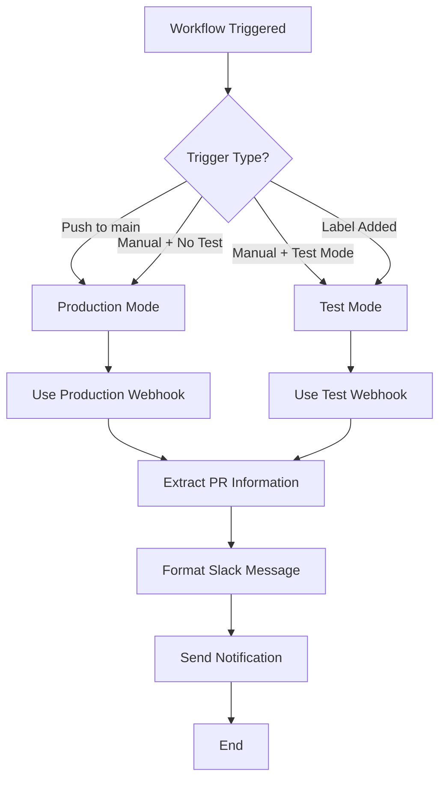
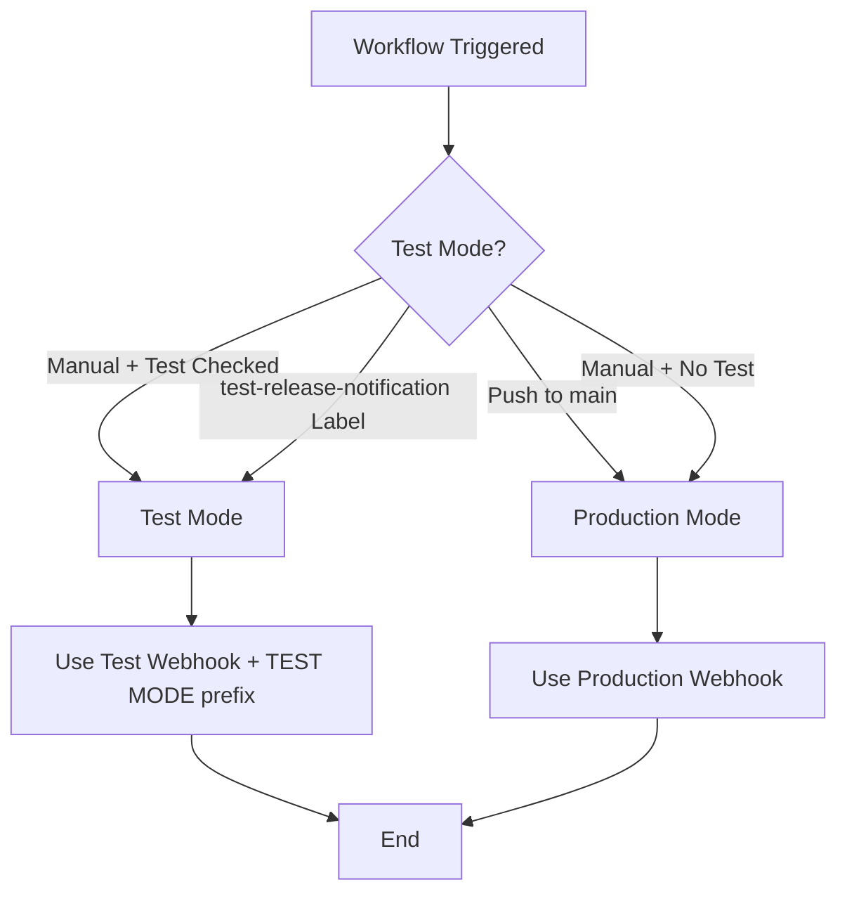

# Release Notification Workflow Documentation

## Overview

The Release Notification workflow automatically sends Slack notifications when releases are deployed to the main branch. This ensures the team is informed about new releases and can track what changes were included.

## Key Features

- ✅ **Automatic release notifications** when code is pushed to main branch
- ✅ **Manual trigger support** with test mode toggle
- ✅ **Label-based testing** with `test-release-notification` label
- ✅ **Jira ticket integration** - extracts and links Jira tickets in notifications
- ✅ **PR information extraction** - shows what changes were included in the release
- ✅ **Test mode support** - uses separate webhook for testing

## Use Cases

### 1. **Production Release Notifications**
- **Trigger**: Push to main branch
- **Action**: Send Slack notification to production channel
- **Purpose**: Notify team about new releases

### 2. **Manual Testing**
- **Trigger**: Manual workflow dispatch
- **Action**: Send notification (test or production based on input)
- **Purpose**: Test the workflow functionality

### 3. **Label-Based Testing**
- **Trigger**: Add `test-release-notification` label to any PR
- **Action**: Send test notification to test channel
- **Purpose**: Test notifications without affecting production

## Workflow Triggers

The workflow triggers on these events:
- `push` to `main` branch (production)
- `pull_request` with `labeled` type (when `test-release-notification` label is added)
- `workflow_dispatch` (manual trigger with test mode option)

## Label Logic

### Production Mode
- **Condition**: Push to main branch OR manual trigger without test mode
- **Webhook**: `SLACK_WEBHOOK_URL` (production channel)
- **Notification**: Standard release notification

### Test Mode
- **Condition**: Manual trigger with test mode checked OR `test-release-notification` label
- **Webhook**: `SLACK_WEBHOOK_URL_TEST` (test channel)
- **Notification**: Release notification with `(TEST MODE)` prefix

## Flowcharts

### Main Workflow Flow



### Test Mode Detection



## Configuration

### Required Labels

The workflow expects these labels to exist in the repository:
- `test-release-notification` - For testing release notifications (optional)

### Slack Integration

The workflow sends formatted Slack notifications with:
- **Repository Info** - Repository name, branch, commit SHA
- **Test URLs** - Links to staging and production environments
- **Changes in Release** - List of PRs and Jira tickets included
- **Test Mode** - `(TEST MODE)` prefix for test notifications

#### Channel Routing
- **Regular notifications** → Production Slack channel (via `SLACK_WEBHOOK_URL`)
- **Test notifications** → Test Slack channel (via `SLACK_WEBHOOK_URL_TEST`)
- **Test mode detection** → Uses `test-release-notification` label or manual test mode input

### Environment Variables

Required secrets in repository settings:
- `SLACK_WEBHOOK_URL` - Production Slack webhook (main channel)
- `SLACK_WEBHOOK_URL_TEST` - Test Slack webhook (test channel)

### Permissions

The workflow requires these permissions:
- `contents: read` - To read repository contents
- `pull-requests: read` - To read PR details and extract information

## Examples

### Example 1: Production Release
```
1. Code pushed to main branch
2. Workflow triggers automatically
3. Extracts recent PRs and Jira tickets
4. Sends notification to production channel
```

### Example 2: Manual Test
```
1. Go to Actions → "Simple Release Notification"
2. Click "Run workflow"
3. Check "Test mode" checkbox
4. Click "Run workflow"
5. Notification sent to test channel with (TEST MODE) prefix
```

### Example 3: Label-Based Test
```
1. Add "test-release-notification" label to any PR
2. Workflow triggers automatically
3. Notification sent to test channel with (TEST MODE) prefix
4. Remove label to stop testing
```

## Troubleshooting

### Common Issues

1. **Workflow not triggering on push to main**
   - **Cause**: Missing or invalid webhook URL
   - **Solution**: Check `SLACK_WEBHOOK_URL` secret in repository settings

2. **Test mode not working**
   - **Cause**: Missing test webhook URL or incorrect label
   - **Solution**: Check `SLACK_WEBHOOK_URL_TEST` secret and ensure label is `test-release-notification`

3. **No PR information in notification**
   - **Cause**: No recent merge commits or API rate limiting
   - **Solution**: Check GitHub API limits and recent commit history

4. **Wrong webhook used**
   - **Cause**: Incorrect test mode detection logic
   - **Solution**: Verify label name and manual trigger test mode input

### Debug Information

The workflow logs detailed information:
- Trigger type (push, manual, label)
- Test mode status
- Webhook URL being used
- PR information extracted
- Notification status

## File Structure

```
.github/workflows/
└── slack-release-notification.yml    # Release notification workflow

RELEASE-NOTIFICATION-DOCUMENTATION.md    # This documentation
```

## Testing Guide

### Step-by-Step Testing

1. **Test Label-Based Trigger**
   - Add `test-release-notification` label to any PR
   - Check Actions tab for workflow run
   - Verify notification sent to test channel

2. **Test Manual Trigger**
   - Go to Actions → "Simple Release Notification"
   - Click "Run workflow"
   - Test both with and without "Test mode" checked

3. **Test Production Trigger**
   - Make a test commit to main branch
   - Verify notification sent to production channel

### Verification Checklist

- [ ] Workflow triggers on push to main
- [ ] Workflow triggers on manual dispatch
- [ ] Workflow triggers on label addition
- [ ] Test mode uses correct webhook
- [ ] Production mode uses correct webhook
- [ ] Notifications include PR information
- [ ] Jira tickets are extracted and linked
- [ ] Test mode shows (TEST MODE) prefix

---

## Maintenance

### Adding New Triggers
1. Add trigger to `on` section in workflow
2. Update condition logic in `if` statement
3. Test with appropriate events
4. Update documentation

### Modifying Notification Format
1. Update Slack message template in workflow
2. Test with both production and test modes
3. Update documentation examples

### Testing Changes
1. Use `test-release-notification` label for safe testing
2. Test with manual trigger and test mode
3. Verify both webhook URLs work correctly
4. Test PR information extraction
