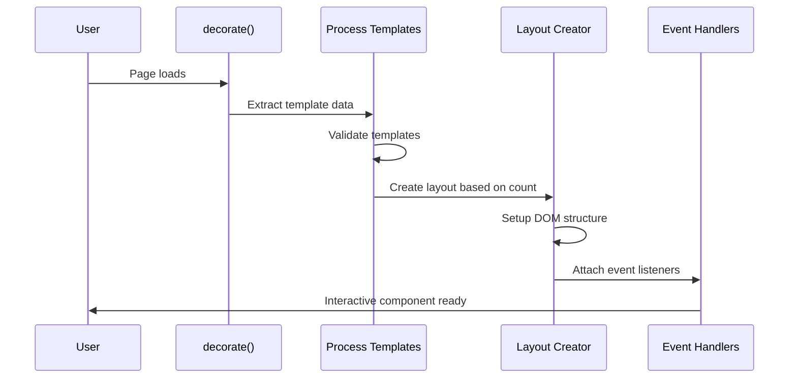
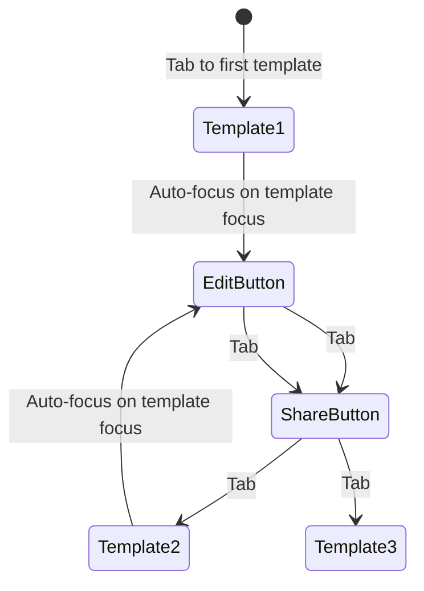
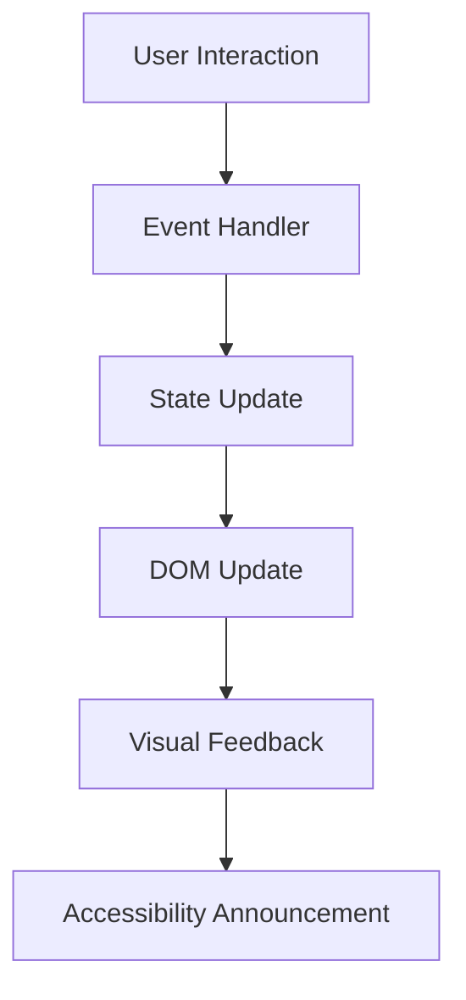
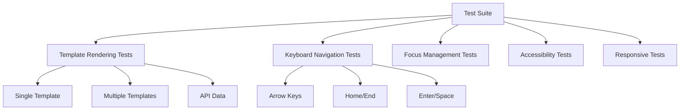
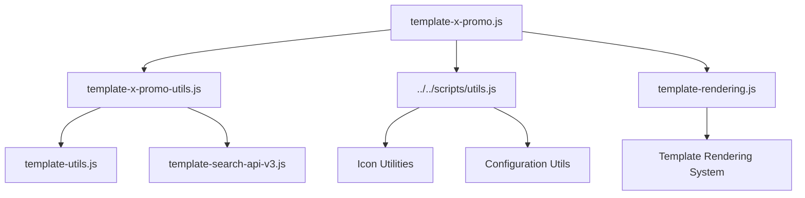

# Template X Promo Block Documentation

## Overview

The `template-x-promo` block is a sophisticated React-like component system that displays Adobe Express templates in either a single template layout or a carousel format. It features advanced keyboard navigation, accessibility support, and responsive design.

## Architecture

### Core Components

```mermaid
graph TB
    A[decorate() - Main Entry Point] --> B{Template Count?}
    B -->|1 Template| C[handleOneUpFromApiData()]
    B -->|Multiple| D[createCustomCarousel()]
    B -->|API Data| E[handleApiDrivenTemplates()]
    
    C --> F[Single Template Display]
    D --> G[Carousel Layout]
    E --> H[API Data Processing]
    
    G --> I[createDesktopLayout()]
    G --> J[createDirectCarousel()]
    
    I --> K[Desktop Grid Layout]
    J --> L[Mobile Carousel]
```

### File Structure

```
template-x-promo/
├── template-x-promo.js          # Main component logic (849 lines)
├── template-x-promo.css         # Styling and responsive design
├── template-x-promo-utils.js    # Utility functions
└── template-x-promo.test.js     # Comprehensive test suite
```

## Main Functions

### 1. `decorate(block)` - Entry Point
The main function that orchestrates the entire component lifecycle.

**Flow:**
```mermaid
flowchart TD
    A[decorate() called] --> B[Initialize utilities]
    B --> C[Extract template data]
    C --> D{Data source?}
    D -->|Static HTML| E[Process existing templates]
    D -->|API URL| F[handleApiDrivenTemplates()]
    E --> G[Route templates]
    F --> G
    G --> H[Apply responsive behavior]
    H --> I[Setup cleanup handlers]
```

### 2. `createCustomCarousel(block, templates)` - Carousel Manager
Handles the creation and management of carousel layouts for multiple templates.

**Key Features:**
- Responsive design (desktop grid vs mobile carousel)
- Keyboard navigation support
- Accessibility compliance
- Event listener management

### 3. `createDesktopLayout(block, templates)` - Desktop Grid
Creates a responsive grid layout for desktop viewing.

**Features:**
- Keyboard navigation (Arrow keys, Home/End, Enter/Space)
- Focus management with `singleton-hover` pattern
- Semantic HTML structure
- Event listener tracking and cleanup

### 4. `createDirectCarousel(block, templates)` - Mobile Carousel
Implements a touch-friendly carousel for mobile devices.

**Features:**
- Touch/swipe navigation
- Auto-play functionality
- Accessibility announcements
- Smooth animations

## Data Flow

### Template Processing Pipeline



### API Data Flow

```mermaid
graph LR
    A[API URL] --> B[fetchDirectFromApiUrl()]
    B --> C[extractTemplateMetadata()]
    C --> D[determineTemplateRouting()]
    D --> E[createCustomCarousel()]
    E --> F[Render Templates]
```

## Keyboard Navigation System

### Desktop Navigation



**Note**: Arrow keys, Home, and End navigation were intentionally removed to prioritize focusing on the "Edit This Template" link when a template gets focus, providing a more direct user experience.

### Focus Management

The component implements a sophisticated focus management system:

1. **Template Focus**: When a template receives focus, it gets the `singleton-hover` class
2. **Button Container**: Becomes visible and interactive
3. **Tab Order**: Template gets `tabindex="-1"`, buttons get `tabindex="0"`
4. **Cleanup**: Previous templates lose `singleton-hover` and return to `tabindex="0"`

### Focus Management Design

**Intentional Design**: The focus management immediately moves focus from the template to the edit button when a template is focused:

```javascript
const handleFocus = (event) => {
  if (event.target.classList.contains('template')) {
    // ... setup singleton-hover ...
    const editButton = event.target.querySelector('.button-container .button');
    if (editButton) {
      editButton.focus(); // Direct focus to primary action
    }
  }
};
```

**Benefits**: This design choice prioritizes user experience by:
- Directing users immediately to the primary action ("Edit This Template")
- Reducing the number of tab stops needed to reach the main functionality
- Providing a more streamlined navigation flow
- Eliminating the need for arrow key navigation between templates

**Trade-off**: Arrow keys, Home, and End navigation were removed to achieve this direct focus behavior.

## Accessibility Features

### ARIA Support

```mermaid
graph TD
    A[Template Container] --> B[role="button"]
    A --> C[aria-label="Template X of Y"]
    A --> D[tabindex="0"]
    
    E[Carousel Track] --> F[role="region"]
    E --> G[aria-label="Template carousel"]
    E --> H[tabindex="0"]
    
    I[Navigation Buttons] --> J[aria-label="Previous/Next"]
    I --> K[aria-describedby="status-id"]
    
    L[Status Announcements] --> M[aria-live="polite"]
    L --> N[aria-atomic="true"]
```

### Keyboard Support

| Key | Action | Status |
|-----|--------|--------|
| `Tab` | Navigate between templates and interactive elements | ✅ Working |
| `Arrow Left/Right` | Navigate between templates | ❌ Intentionally removed |
| `Home` | Jump to first template | ❌ Intentionally removed |
| `End` | Jump to last template | ❌ Intentionally removed |
| `Enter/Space` | Activate template (focuses edit button) | ✅ Working |
| `Escape` | Close any open tooltips | ❌ Not implemented |

## Event Management

### Event Listener Tracking

The component uses a sophisticated event listener management system:

```javascript
const eventListeners = new Map();

const addTrackedListener = (element, event, handler) => {
  element.addEventListener(event, handler);
  const key = `${element}-${event}`;
  eventListeners.set(key, { element, event, handler });
};

// Cleanup on destroy
eventListeners.forEach(({ element, event, handler }) => {
  element.removeEventListener(event, handler);
});
```

### Event Flow



## Responsive Design

### Breakpoint Strategy

```mermaid
graph LR
    A[Mobile < 768px] --> B[createDirectCarousel()]
    C[Desktop >= 768px] --> D[createDesktopLayout()]
    
    B --> E[Touch Navigation]
    B --> F[Auto-play]
    B --> G[Carousel Controls]
    
    D --> H[Grid Layout]
    D --> I[Keyboard Navigation]
    D --> J[Hover Effects]
```

### CSS Variables

The component uses CSS custom properties for responsive behavior:

```css
.ax-template-x-promo {
  --template-gap-mobile: 8px;
  --template-gap-desktop: 16px;
  --template-gap-large: 24px;
}
```

## Testing Strategy

### Test Coverage

The component includes comprehensive tests covering:

1. **Unit Tests** (Jest/Mocha)
   - Template rendering
   - Keyboard navigation
   - Focus management
   - Event handling

2. **Integration Tests** (Playwright)
   - End-to-end user flows
   - Accessibility compliance
   - Cross-browser compatibility

3. **Visual Tests** (Nala)
   - Layout verification
   - Responsive behavior
   - Interactive states

### Test Structure



## Performance Optimizations

### Memory Management

1. **Event Listener Cleanup**: All listeners are tracked and removed on destroy
2. **DOM Query Optimization**: Cached selectors and targeted queries
3. **Lazy Loading**: Templates are processed only when needed

### Code Quality

1. **ESLint Compliance**: Single `eslint-disable` for underscore properties
2. **No Console Logs**: Production-ready code
3. **Semantic HTML**: Proper button elements and ARIA attributes
4. **Security**: No `innerHTML` usage, uses `createTag` pattern

## Integration Points

### Dependencies



### External APIs

The component can integrate with Adobe's template APIs:

1. **Template Search API v3**: For fetching template data
2. **Template Utils**: For validation and processing
3. **Configuration System**: For dynamic behavior

## Future Enhancements

### Planned Improvements

1. **Intersection Observer**: For lazy loading and performance
2. **Module Splitting**: Break down large functions (currently 849 lines)
3. **Enhanced Animations**: Smooth transitions and micro-interactions
4. **Advanced Filtering**: Template categorization and search

### Extension Points

The component is designed for extensibility:

1. **Plugin Architecture**: Easy addition of new carousel types
2. **Custom Event System**: Hook into component lifecycle
3. **Theme Support**: CSS custom properties for styling
4. **API Integration**: Flexible data source handling

## Troubleshooting

### Common Issues

1. **Focus Not Working**: Check `tabindex` attributes and event listeners
2. **Carousel Not Responsive**: Verify CSS breakpoints and JavaScript detection
3. **Memory Leaks**: Ensure all event listeners are properly cleaned up
4. **Accessibility Issues**: Validate ARIA attributes and keyboard navigation

### Debug Tools

1. **Console Logging**: Temporarily enable for debugging (removed in production)
2. **DOM Inspection**: Check for proper class names and attributes
3. **Event Monitoring**: Use browser dev tools to track event flow
4. **Accessibility Audits**: Use browser accessibility tools

---

## Quick Reference

### Key Functions
- `decorate(block)` - Main entry point
- `createCustomCarousel(block, templates)` - Carousel manager
- `createDesktopLayout(block, templates)` - Desktop grid
- `createDirectCarousel(block, templates)` - Mobile carousel

### Key Classes
- `.ax-template-x-promo` - Main container
- `.template` - Individual template wrapper
- `.singleton-hover` - Focused template state
- `.button-container` - Interactive controls

### Key Events
- `keydown` - Keyboard navigation
- `focus`/`blur` - Focus management
- `click` - User interactions
- `resize` - Responsive behavior

This documentation provides a comprehensive overview of the template-x-promo component, its architecture, and how it all works together to create a robust, accessible, and performant template display system.
