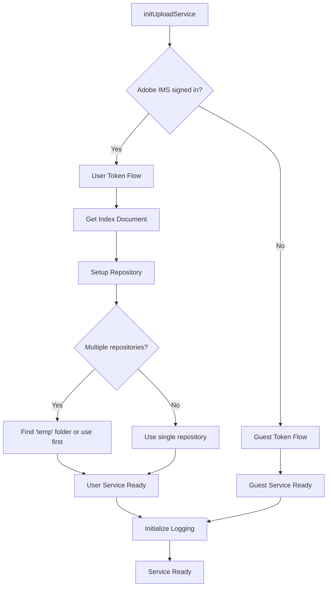
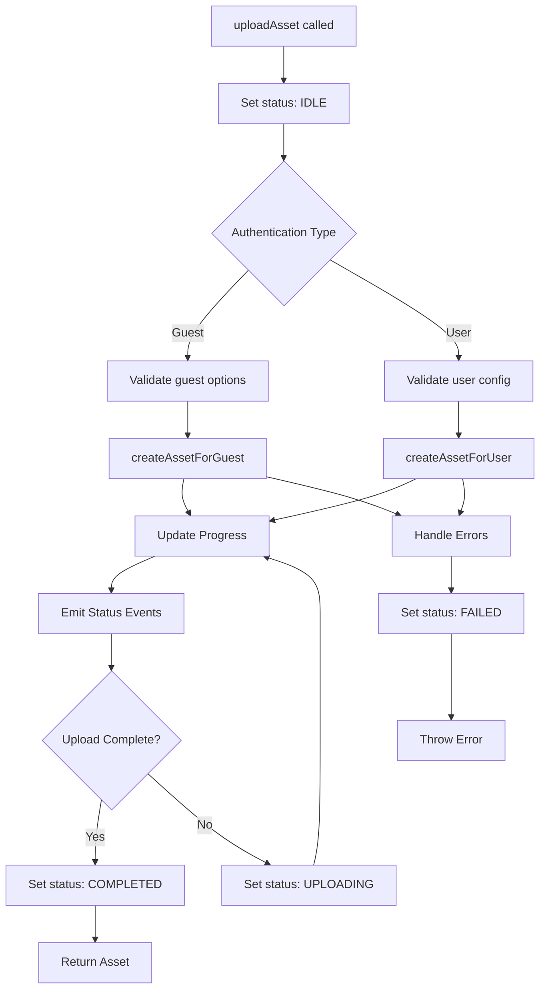

## Upload Service

Client-side library to upload assets to Adobe Content Platform Storage. Supports guest and signed-in users, comprehensive logging, progress events, error handling, and automatic repository management.

### Features

- **Dual Authentication**: Automatic detection and support for guest and authenticated users
- **Progress Tracking**: Real-time upload progress with custom events
- **Environment-aware Logging**: Enhanced logging in development environments
- **Error Handling**: Comprehensive error codes and status handling
- **Repository Auto-discovery**: Automatic repository setup for authenticated users
- **Pre-signed URLs**: Generate downloadable URLs for uploaded assets

### Quick Start

```ts
import { initUploadService, UPLOAD_EVENTS } from './dist/upload-service.min.es.js';

// Initialize service (automatically detects user authentication)
const service = await initUploadService({ environment: 'local' });

// Upload an asset
const result = await service.uploadAsset({
  file,
  fileName: 'photo.png',
  contentType: 'image/png',
  path: 'assets'
});

// Listen for upload progress
window.addEventListener(UPLOAD_EVENTS.UPLOAD_STATUS, (e) => {
  console.log(`Upload ${e.detail.status}: ${e.detail.progress}%`);
});
```

### API Reference

#### Core Methods
- `initUploadService(options)`: Initialize service with environment configuration
- `uploadAsset(options)`: Upload file and return asset information
- `generatePreSignedUrl(options)`: Generate downloadable URL for an asset
- `updateConfig(config)`: Update service configuration
- `getConfig()`: Get current service configuration

#### Event Handling
- `UPLOAD_EVENTS.UPLOAD_STATUS`: Upload progress and status events
- Status values: `'idle'`, `'uploading'`, `'completed'`, `'failed'`

#### Upload Options
```ts
interface UploadOptions {
  file: File | Blob | ArrayBuffer;           // File to upload
  fileName: string;                          // File name
  contentType: string;                       // MIME type
  path?: string;                            // Upload path (optional)
  createIntermediates?: boolean;            // Create directories (user uploads)
  onProgress?: UploadProgressCallback;       // Progress callback
  additionalHeaders?: Record<string, string>; // Extra headers
  repoMetaPatch?: RepoMetaPatch;            // Metadata patch
  resourceDesignator?: ResourceDesignator;   // Response format
}
```

### Authentication Flows

The service automatically detects user authentication state using Adobe IMS:



### Upload Process Flow



### Logging and Debugging

The service includes comprehensive logging that activates in local environments:

#### LogService Features
- **Environment-aware**: Only logs in local development
- **Dynamic Loading**: EnhancedLogging module loaded on-demand
- **Structured Logging**: Consistent log markers and formatting

#### Enhanced Logging Capabilities
- **Upload Start**: Context and configuration logging
- **Progress Tracking**: Detailed progress information
- **Response Analysis**: Status code interpretation with icons
- **Error Details**: Comprehensive error context and suggestions
- **Performance Metrics**: File sizes, timing, and response headers

#### Log Markers
```ts
const MARKERS = {
  LOG_UPLOAD_START: 'LOG_UPLOAD_START',     // Upload initiation
  LOG_UPLOAD_RESPONSE: 'LOG_UPLOAD_RESPONSE', // Server response
  LOG_UPLOAD_STATUS: 'LOG_UPLOAD_STATUS',    // Status code handling
  LOG_UPLOAD_ERROR: 'LOG_UPLOAD_ERROR'      // Error scenarios
};
```

### Error Handling

The service provides detailed error codes for different failure scenarios:

| Error Code | Description |
|------------|-------------|
| `UPLOAD_FAILED` | General upload failure |
| `URL_GENERATION_FAILED` | Pre-signed URL generation failed |
| `REPOSITORY_REQUIRED` | Repository missing for user uploads |
| `DIRECTORY_REQUIRED` | Directory missing for user uploads |
| `FAILED_TO_CREATE_ASSET` | Asset creation failed |

### Environment Configuration

```ts
// Supported environments
const environments = {
  local: 'https://platform-cs-stage.adobe.io',  // Development
  stage: 'https://platform-cs-stage.adobe.io',  // Staging
  prod: 'https://platform-cs.adobe.io'          // Production
};
```

### Status Code Handling

The service provides detailed HTTP status code interpretation:

- **2xx Success**: ✅ Upload successful/accepted
- **3xx Redirect**: ℹ️ Redirect responses
- **4xx Client Error**: ❌ Authentication, validation, or permission issues
- **5xx Server Error**: ❌ Server-side failures with retry guidance

### User vs Guest Differences

| Feature | Guest Users | Authenticated Users |
|---------|-------------|-------------------|
| **Repository** | Not required | Auto-discovered from index |
| **Directory Structure** | Flat storage | Hierarchical with intermediates |
| **Metadata** | Limited | Full repository metadata |
| **Permissions** | Temporary access | User-scoped permissions |
| **Path Management** | Simple paths | Complex directory structures |

### Development

```bash
# Development server
npm run dev

# Build for production
npm run build
```

### Advanced Usage

#### Custom Progress Handling
```ts
const customProgressHandler = (bytesCompleted, totalBytes) => {
  const percentage = Math.round((bytesCompleted / totalBytes) * 100);
  console.log(`Upload progress: ${percentage}%`);
};

await service.uploadAsset({
  file,
  fileName: 'document.pdf',
  contentType: 'application/pdf',
  onProgress: customProgressHandler
});
```

#### Repository Metadata
```ts
await service.uploadAsset({
  file,
  fileName: 'asset.jpg',
  contentType: 'image/jpeg',
  repoMetaPatch: {
    'dc:title': 'My Custom Title',
    'dc:description': 'Asset description'
  }
});
```

#### Pre-signed URL Generation
```ts
const result = await service.uploadAsset(uploadOptions);
const downloadUrl = await service.generatePreSignedUrl({
  asset: result.asset
});
```
```