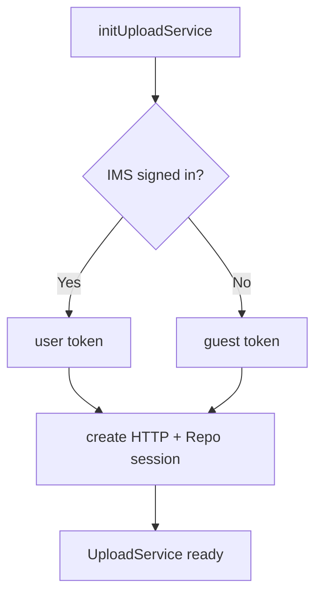
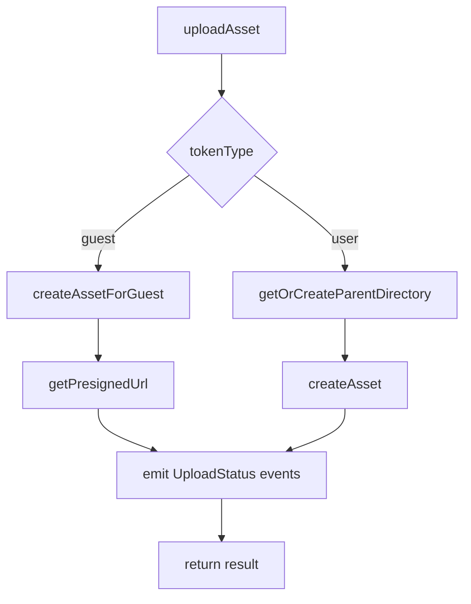

## Upload Service

Client-side library to upload assets to Adobe Content Platform Storage. Supports guest and signed-in users, progress events, and optional pre‑signed download URLs.

Usage
```ts
import { initUploadService, UPLOAD_EVENTS } from './dist/acp-upload.min.es.js';

const service = initUploadService();
service.updateConfig({ repositoryId: 'your-repo-id' }); // required for user uploads

const result = await service.uploadAsset({
  file, fileName: 'photo.png', contentType: 'image/png', path: 'assets'
});

window.addEventListener(UPLOAD_EVENTS.UPLOAD_STATUS, (e: any) => console.log(e.detail.status));
```

API
- initUploadService(): UploadService
- UploadService.uploadAsset(options): { asset, readablePreSignedUrl?, shareablePreSignedUrl? }
- UploadService.generatePreSignedUrl({ asset }): string

Build
- Dev: `npm run dev`  Build: `npm run build`




